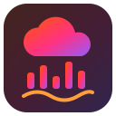
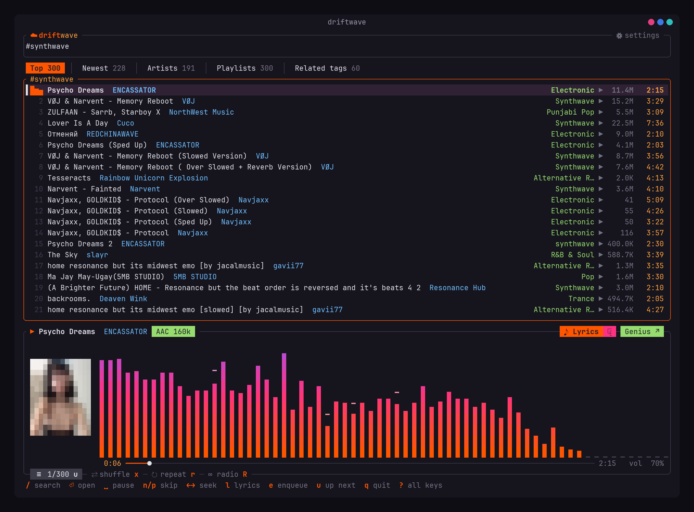
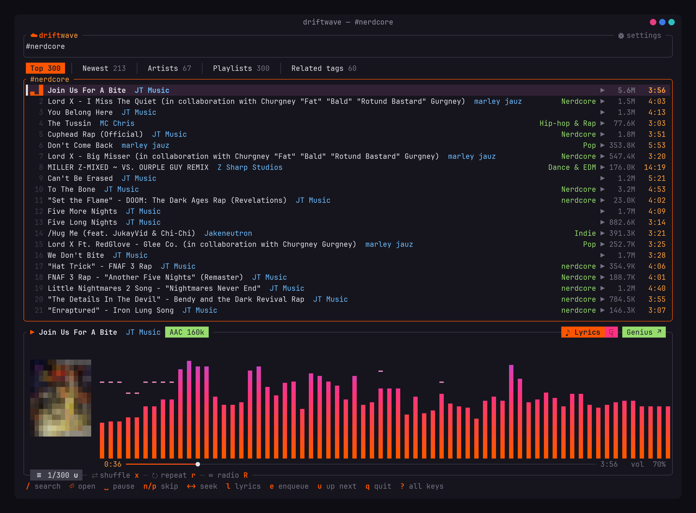
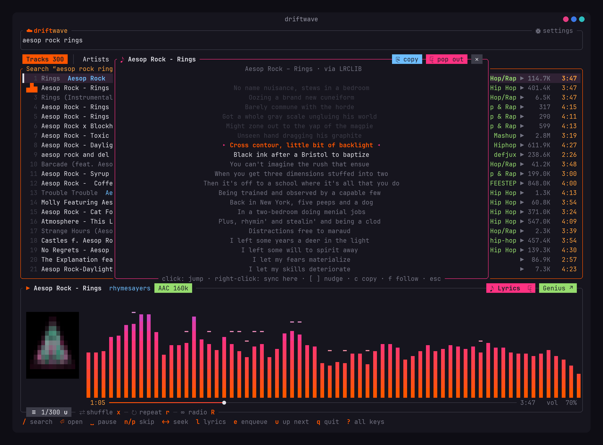
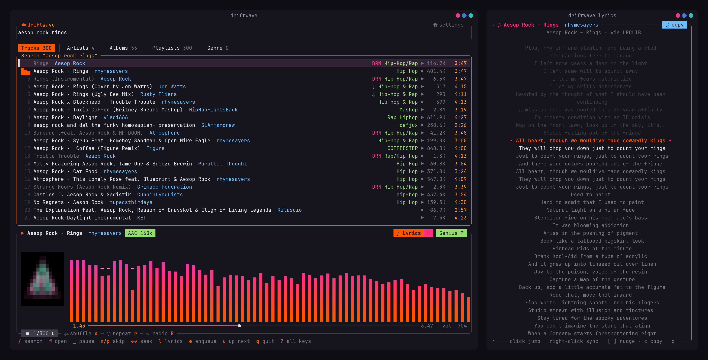

<p align="center">
  
</p>

<h1 align="center">driftwave</h1>

<p align="center">
  Stream SoundCloud in your terminal: full artist catalogs, genres, lyrics that follow the song,
  a live visualizer, media keys. No account needed.
</p>

<p align="center">
  <a href="https://github.com/ZeroDay-Labz/driftwave/releases/latest"></a>
  <a href="https://github.com/ZeroDay-Labz/driftwave/actions/workflows/ci.yml"></a>
  <a href="https://github.com/ZeroDay-Labz/driftwave/releases"></a>
  <a href="LICENSE"></a>
</p>

<p align="center">
  
</p>

## Features

- **Search everything**: tracks, artists, albums and playlists (up to ~300 results each)
- **Whole artist catalogs**: popular tracks, every upload, albums/EPs/singles, playlists
- **Browse by genre or tag**: `#nerdcore`, `#folk punk`, `#hackercore`… with top and newest
  tracks, the genre's artists and playlists, and related tags to keep exploring
- **Instant streaming** in AAC 160k, with the next track preloaded for gapless autoplay
- **Plays around DRM**: label tracks SoundCloud only streams encrypted are marked `DRM`, and
  driftwave plays another upload of the same song instead (often the label's own account)
- **Queue, shuffle, repeat, and endless radio** (keeps playing related tracks)
- **Live spectrum visualizer** and small album art (kitty/sixel graphics, block fallback elsewhere)
- **Lyrics that follow the song**: synced lyrics from [LRCLIB](https://lrclib.net), Genius as a
  fallback, in the app or a **pop-out window**. Click a line to jump there, fix the timing with a
  right-click, and copy lyrics to the clipboard
- **Library folder**: saves lyrics (`.lrc`/`.txt`) and covers, and uses your own `.lrc` files first
- **Official downloads** for tracks whose uploader enabled them (marked `⤓` in lists)
- **Media keys, headset buttons, KDE/GNOME media widgets** (MPRIS) and track notifications
- **Mouse everywhere**: click, double-click, right-click, scroll, drag to seek
- **Always shows its keys**: a key legend at the bottom, and every button shows its shortcut
- Remembers your volume, modes, history and lyrics timing fixes

<p align="center">
  
  
</p>

## Install

Download the latest package from [Releases](https://github.com/ZeroDay-Labz/driftwave/releases):

| Distro | Package | Install |
|---|---|---|
| Fedora, openSUSE, RHEL | `driftwave-*.x86_64.rpm` | `sudo dnf install ./driftwave-*.rpm` |
| Debian, Ubuntu, Mint, Pop | `driftwave_*_amd64.deb` | `sudo apt install ./driftwave_*.deb` |
| Any (Flatpak) | `driftwave.flatpak` | `flatpak install --user ./driftwave.flatpak` |

Then run `driftwave` in a terminal (Flatpak: `flatpak run io.github.ZeroDay_Labz.driftwave`).

### Build from source

Needs Rust 1.88+ and the ALSA headers (`alsa-lib-devel` on Fedora, `libasound2-dev` on Debian/Ubuntu).

```
cargo install --path .
driftwave                    # recently played / last search
driftwave daft punk          # start with a search
driftwave https://soundcloud.com/artist/track
```

## Using it

The bottom line always shows the main keys, and `?` lists them all. The buttons on the player
(`☰ queue u`, `⇄ shuffle x`, `↻ repeat r`, `∞ radio R`, `♪ Lyrics`, `⧉`, `Genius ↗`) are clickable too.

| Key | Action |
|---|---|
| `/` | search (or paste a soundcloud.com link) |
| `⏎` / double-click | play / open artist or album |
| `tab` / `1`–`4` | switch tabs |
| `a` | go to the artist |
| `#` | browse a genre or tag (`#folk punk`); or click a track's green genre |
| `t` | open the selected track's genre |
| `esc` | back |
| `␣` | pause (or click the visualizer) |
| `n` / `p` | next / previous (`p` restarts the song if you're more than 3 s in) |
| `←` / `→` | seek 10 s (or click / drag the progress bar) |
| `+` / `-` | volume (or scroll over the player) |
| `e` / `E` | add to queue / play next |
| `u` | show the queue (`⏎` jump, `d` remove) |
| `x` / `r` / `R` | shuffle / repeat / radio |
| `h` | recently played |
| `l` / `L` | lyrics / pop lyrics out into their own window |
| `[` / `]` | lyrics timing 0.5 s earlier / later |
| `c` | copy the lyrics |
| `o` | search the song on Genius in your browser |
| `D` | official download |
| `,` | settings |
| `q` | quit |

## Genres and tags

Type `#` and a genre or tag in search, like `#nerdcore` or `#folk punk`, or click the green genre
on any track. A genre page has:

- **Top**: the most popular tracks tagged with it
- **Newest**: the latest uploads
- **Artists**: who makes it, ranked by how many of those tracks are theirs
- **Playlists**: tagged albums and playlists
- **Related tags**: tags that show up alongside it (nerdcore → hackercore, chiptune, …). Press
  `⏎` on one to go there.

A normal search (no `#`) also gets a **Genre** tab with the tracks tagged with what you typed.

## Lyrics

driftwave looks for lyrics in this order: your **library folder**, **LRCLIB**, then **Genius**.

- **Synced** lyrics (LRCLIB) have a time for every line: the current line is highlighted in
  orange (`▸ … ◂`) and the view scrolls with the song.
- **Unsynced** lyrics (Genius, or plain text) have no timing, so driftwave estimates it from
  the song's length. The current line shows in amber (`› … ‹`) and the header says
  "following roughly".

**If the lyrics are off:**

- **Right-click the line that's being sung right now.** For synced lyrics that fixes the whole
  song. For unsynced lyrics it pins that line. Pin one early and one late line and the rest
  lines up between them.
- `[` / `]` shift everything 0.5 s earlier / later.
- Fixes are saved per track. The header shows the current adjustment.

**Other controls:**

- Click a line to jump to it.
- Scrolling pauses following for 5 s. Press `f` or click `↓ follow` to go back.
- `c` or the `⎘ copy` button copies the lyrics (via `wl-copy`, `xsel`/`xclip`, or your
  terminal's clipboard support).

All of this works the same in the pop-out window (`L`):

<p align="center">
  
</p>

## Settings and library

Open Settings with `,` (or click ⚙):

| Setting | What it does |
|---|---|
| Library folder | where lyrics, covers and downloads go (default `~/Music/driftwave`; empty turns it off) |
| Save lyrics / cover art | keep them in the library |
| Genius lyrics fallback | use Genius when LRCLIB has nothing |
| Track notifications | a desktop notification when a track starts |
| Lyrics window terminal | auto (kitty → konsole → xterm), or pick one |
| SoundCloud session | only needed for official downloads (see below) |

The library folder looks like this:

```
Lyrics/Artist - Title.lrc    synced lyrics (or .txt)
Covers/Artist - Title.jpg
Downloads/Artist - Title.wav|mp3|…
```

Drop your own `Artist - Title.lrc` into `Lyrics/` and driftwave uses it instead of looking online.

**Official downloads** only work for tracks where the uploader turned on SoundCloud's download button
(marked `⤓`), and need your SoundCloud session: sign in at soundcloud.com, open DevTools →
Storage → Cookies, copy `oauth_token`, and paste it in Settings. It's stored privately (0600) in
`~/.config/driftwave/state.json` and only sent to SoundCloud.

### Lyrics window placement (KDE)

Wayland doesn't let apps position their own windows. To keep the pop-out beside the player:
System Settings → Window Management → Window Rules → Add New → *Window title* contains
`driftwave lyrics` → add *Position* and *Size* set to *Remember*. Place it once and KDE keeps it
there.

### What the tags in a track list mean

| Tag | Meaning |
|---|---|
| green text (`Nerdcore`, `Hardstyle`…) | the track's genre; click it (or press `t`) to browse that genre |
| `⤓` | the uploader allows downloads; press `D` to save it (needs your session, see above) |
| `DRM` | SoundCloud only streams it encrypted; driftwave plays another upload instead |
| `preview` | a SoundCloud Go+ track: only 30 seconds play |
| `AAC 160k` / `MP3 128k` | the quality of what's playing |

## Troubleshooting

- **A track is marked `DRM` / won't play**: many label releases are only streamed encrypted.
  driftwave plays another upload of the same song when there is one. It won't pick remixes,
  covers or edits, and the status line says whose upload it chose. If there's none, it skips to
  the next track.
- **Only 30 seconds play (`preview`)**: that's a SoundCloud Go+ track. Full playback needs a
  subscription on SoundCloud itself.
- **Lyrics out of sync**: see [Lyrics](#lyrics). One right-click on the current line usually fixes it.
- **No album art**: images need a terminal with graphics support (kitty, WezTerm, Konsole,
  foot…). Others show a blocky version, and tmux shows none.
- **Lyrics window doesn't open**: set the terminal in Settings, or run with
  `DRIFTWAVE_TERMINAL=alacritty` (any terminal that accepts `-e <command>`).

## Notes

- driftwave uses the SoundCloud web player's public client id and reads lyrics from Genius's
  website when LRCLIB has none. Neither is an official API (you can turn Genius off in Settings).
  It's for personal listening, not affiliated with SoundCloud or Genius.

## Building and contributing

```
git clone https://github.com/ZeroDay-Labz/driftwave && cd driftwave
cargo run --release -- daft punk
cargo clippy --all-targets -- -D warnings && cargo test   # what CI runs
cargo test -- --ignored                                   # live tests against SoundCloud/LRCLIB/Genius
```

- Releases are built by GitHub Actions: pushing a `v*` tag builds the `.deb`, `.rpm` and
  Flatpak and attaches them to a release (`.github/workflows/release.yml`).
- `scripts/screenshots/capture.sh` regenerates the screenshots in `docs/screenshots/` off-screen
  (hidden tmux sessions and a silent audio sink, so nothing plays or pops up).

Bug reports and pull requests are welcome.

## License

MIT, see [LICENSE](LICENSE).
